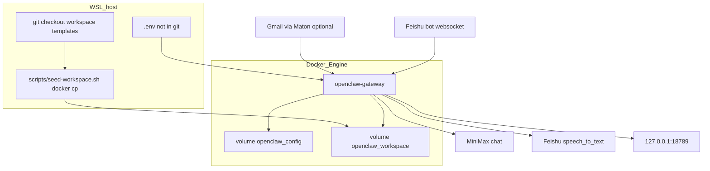

# HR-Insight

Self-hosted hiring assistant. It lives in Feishu, turns inbound resumes into structured candidate records, and keeps notes consistent across a hiring cycle.

## Why Docker

HR-Insight is an agent with a workspace, a model, and tools. If that process is installed on the host, it inherits the operator's home directory: resumes land next to personal files, `~/.openclaw` outlives the repo, and a prompt can ask the agent to read paths it should never see.

This project therefore runs the gateway **only** as a container on the **WSL Docker Engine**. Docker Desktop on Windows is not part of the design. If Desktop is installed, leave that distro stopped so the Linux engine owns `docker.sock`.

What that choice buys, in this repo:

| Decision | What we do | What we refuse |
| --- | --- | --- |
| Filesystem | Named volumes `openclaw_config` → `/home/node/.openclaw` and `openclaw_workspace` → `/home/node/.openclaw/workspace` | Bind-mount `~/`, this git checkout, `/mnt/c`, `/mnt/f`, or any Windows path |
| Process | `docker compose up`; identity and skills are copied in with `scripts/seed-workspace.sh` (`docker cp`) | `openclaw onboard --install-daemon` on the host; a leftover agent under the user's home |
| Runtime | Image `clawproject-openclaw:local` = `openclaw/openclaw` plus `python3`, `pypdf`, `ffmpeg`, `curl` | Asking each operator to install those on WSL or Windows |
| Network | Publish `127.0.0.1:18789` (Control UI / gateway) and `127.0.0.1:18790` | Bind `0.0.0.0`, mount `docker.sock`, or run privileged |
| Secrets | `.env` on the host, passed as container env; never committed | Baking keys into the image or writing them into the git workspace |

Candidate PDFs, transcripts, and compare reports therefore exist only inside `openclaw_workspace`. Deleting the compose project volumes wipes hiring data; the host disk is not a second copy. That is intentional: isolation over convenience.

## Architecture

```
                    loopback only
  browser  ------>  127.0.0.1:18789  Control UI
                         |
  Feishu DM  --WS----->  openclaw-gateway          MiniMax M3
  (optional Gmail)       (clawproject-openclaw)    Feishu ASR
         |                      |                  Maton (optional)
         |                      v
         |              openclaw_workspace
         |                AGENTS / HIRING / skills
         |                candidates/{slug}/
         |                hiring/pipeline.md
         |                comparisons/
         |
         +-------- structured reply in Feishu
```



**Control plane.** Compose service `openclaw-gateway` is the only always-on process. It loads plugin config from `openclaw_config` (Feishu app id/secret, model routing) and the agent brain from `openclaw_workspace`. An optional `openclaw-cli` profile shares the same two volumes when you need a one-shot CLI against that state.

**Identity vs runtime data.** Files under repo `workspace/` are the source of truth for persona and skills (`AGENTS.md`, `SOUL.md`, `USER.md`, `IDENTITY.md`, `HIRING.md`, `skills/*`). They are not mounted. After the container is up, `seed-workspace.sh` copies them in. Existing `hiring/pipeline.md` in the volume is not overwritten, so live candidate rows survive a re-seed.

**Inbound paths.**

1. Feishu file (PDF or audio) → save under `candidates/{slug}/` in the volume.
2. Optional Gmail: operator connects **their** hiring inbox with Maton (`install-gmail-skill.sh` + `connect-gmail.sh`). Attachments take the same volume path. A personal mailbox is not required to run the desk.
3. `pdf_resume_to_md` turns `resume.pdf` into `resume.md` with local `pypdf` (no network).
4. `interview_transcribe` converts audio with `ffmpeg` and calls Feishu ASR (`speech_to_text:speech`; clips over ~55s use stream recognize). Whisper-compatible API is an override, not the default.
5. `candidate_compare` reads two or more `profile.md` files, replies in Feishu, and writes `comparisons/{role}-{date}.md`. Judgments do not go into `MEMORY.md`.

**Outbound.** Chat replies stay in Feishu. Sending email is ask-first. The agent must not write to a host Desktop or home directory; `HIRING.md` is the path contract.

**Trust boundary.** The model (MiniMax) sees whatever the gateway puts in context from the workspace volume and the current Feishu thread. It does not see the host filesystem. Operators who need a new machine copy the repo, fill `.env`, compose up, and seed — they do not inherit another person's `~/.openclaw`.

## Run

```bash
cp .env.example .env
# fill gateway token, Feishu app credentials, and MiniMax key
docker compose up -d --build
./scripts/seed-workspace.sh
./scripts/configure-feishu.sh
```

Control UI: `http://127.0.0.1:18789/`

## Optional channels

**Gmail resume intake** — optional. Connect the **hiring inbox** you want the bot to read, not a personal mailbox unless that is intentional.

1. Create a Maton key at https://maton.ai/settings and put it in `.env` as `MATON_API_KEY`.
2. `ctrl.maton.ai` is retired (it returns `{"detail":"Not Found"}`).
3. Install the skill, then generate a fresh authorize URL:

```bash
./scripts/install-gmail-skill.sh
./scripts/connect-gmail.sh
```

4. Open the printed `connect.maton.ai` link within about 30 minutes. If you see `Session token expired`, run `./scripts/connect-gmail.sh` again.
5. On the Google permission screen, grant **all Gmail access**. Unchecking mail scopes makes the connection look active but unread checks fail with `insufficient authentication scopes`.
6. In Feishu: ask to check unread mail for new resumes. Attachments land under `candidates/{slug}/` in the workspace volume, not on the host desktop.

To replace an inbox: `MATON_FORCE_RECONNECT=1 ./scripts/connect-gmail.sh` and authorize the new account.

**Interview transcription** — send an `m4a` / `mp3` / `wav` in Feishu. The default backend is Feishu speech-to-text (same app as the bot). Enable the `speech_to_text:speech` scope on that app, then create a new version and publish it. Optional override: `WHISPER_API_KEY` plus `WHISPER_BASE_URL`.

**Compare candidates** — after a second resume is in `candidates/`, ask Feishu to compare them. The report is written to `comparisons/`.

## Layout

- `workspace/` — agent identity, operating rules, and skills
- `scripts/` — one-shot setup against the running container
- `docker-compose.yml` — isolated gateway on loopback ports
